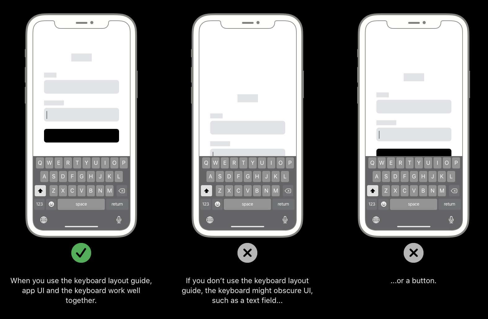
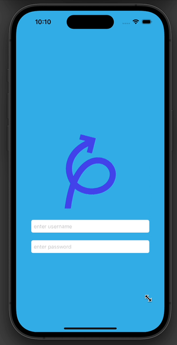

# Keyboard Handling
For many iOS applications, keyboard handling is very important. For a seamless user experience, the keyboard should not be covering important views
such as buttons, labels, text fields, etc.

To fix this issue if it arrises, a good implementation is to capture the keyboard appearing and disappearing via the NotificationCenter.

### Human Interface Guideline regarding keyboard (Photo credit @ apple inc.)



## Example 


Notice that the view moves up when the keyboard appears and moves back down when the keyboard disappears (pulsing animation is not relevant but there cause why not?!)

## Code
``` Swift
    private func registerForKeyboardNotifications() {
        // 1. register the type of notification, i.e notifications for the keyboard
        NotificationCenter.default.addObserver(self, selector: #selector(keyboardWillShow), name: UIResponder.keyboardWillShowNotification, object: nil)
        
        NotificationCenter.default.addObserver(self, selector: #selector(keyboardWillHide), name: UIResponder.keyboardWillHideNotification, object: nil)
    }
    
    private func unregisteredForKeyboardNotifications() {
        NotificationCenter.default.removeObserver(self, name: UIResponder.keyboardWillShowNotification, object: nil)
        NotificationCenter.default.removeObserver(self, name: UIResponder.keyboardWillHideNotification, object: nil)
    }
    
    @objc private func keyboardWillShow(_ notification: NSNotification) {
        // 2. code that will be executed when the keyboard appears
        
        // to get the correct key, print(notification.userInfo)
        
        // UIKeyboardFrameBeginUserInfoKey NSRect: {{0(x), 852(y)}, {393(w), 336(h)}}
        guard let keyboardFrame = notification.userInfo?["UIKeyboardFrameEndUserInfoKey"] as? CGRect else {
            return
        }
        moveKeyboardUp(keyboardFrame.size.height)
    }
    
    @objc private func keyboardWillHide(_ notification: NSNotification) {
        // TODO: More code
        resetUI()
    }
    
    private func moveKeyboardUp(_ height: CGFloat) {
        if keyboardIsVisible { return }
        originalYConstraint = pursuitLogoYConstraint // save original value
        keyboardIsVisible = true
        pursuitLogoYConstraint.constant -= (height * 0.5)
        
        UIView.animate(withDuration: 0.5) {
            self.view.layoutIfNeeded()
        }
    }
    
    private func resetUI() {
        keyboardIsVisible = false
        pursuitLogoYConstraint.constant -= originalYConstraint.constant
        UIView.animate(withDuration: 0.5) {
            self.view.layoutIfNeeded()
        }
    }
   ```
